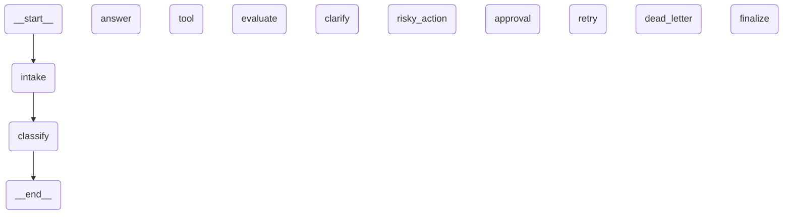

# LangGraph Workflow Diagram

## Architecture Overview

This diagram shows the complete workflow with all nodes, edges, and conditional routing.

## Node Descriptions

- **intake**: Normalize and validate query
- **classify**: Route based on keywords (priority-based)
- **answer**: Generate final response
- **tool**: Execute mock tool
- **evaluate**: Check if tool result is satisfactory (retry gate)
- **clarify**: Ask for missing information
- **risky_action**: Prepare high-risk action
- **approval**: HITL approval gate
- **retry**: Record retry attempt
- **dead_letter**: Escalate unresolvable failure
- **finalize**: Cleanup and final audit

## Routing Logic

### After Classify
- `simple` → answer
- `tool` → tool
- `missing_info` → clarify
- `risky` → risky_action
- `error` → retry

### After Evaluate (Retry Loop Gate)
- `needs_retry` → retry
- `success` → answer

### After Retry (Bounded Loop)
- `attempt < max_attempts` → tool
- `attempt >= max_attempts` → dead_letter

### After Approval
- `approved=true` → tool
- `approved=false` → clarify
